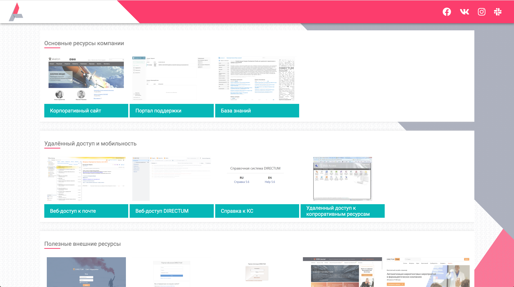

# akelon-start-page

To start project locally follow terminal command: `npm start`. Local server will run automatically.

To build project: 
1. Use `npm run build` terminal command to create production ready build
2. Configure your http web server to `/build` directory
3. Enjoy yourself!